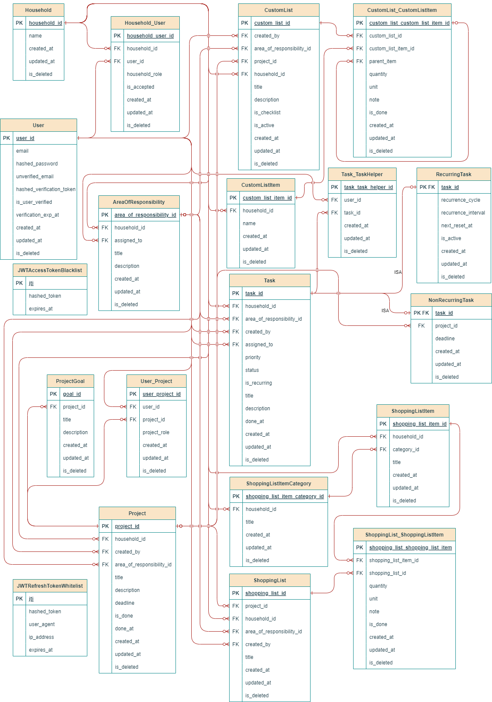

# The Mental Load Hub

**The Mental Load Hub** is a household organization application designed to simplify daily life for any shared living arrangement. The app provides a centralized platform for managing tasks, projects, shopping lists, and custom lists, enabling household members to collaborate efficiently and reduce organizational overhead.

## About the Project

For details on project planning and the current status, see: [The Mental Load Hub - GitHub Projects](https://github.com/users/dominikoetiker/projects/1)

The goal of The Mental Load Hub is to streamline household management by offering features that help users:
- Organize and assign daily tasks with priorities and deadlines.
- Manage recurring chores and one-time tasks through visual status tracking and Kanban boards.
- Create and maintain shopping lists with real-time synchronization.
- Define areas of responsibility to clearly allocate household duties.
- Manage complex projects by breaking them into manageable tasks and setting clear goals.
- Enhance data entry with auto-completion suggestions for frequently used items.
- Stay informed with customizable reminders and notifications.
- Adapt the interface to multiple languages and regional settings.

This project is currently in development. The repository will evolve as new features are implemented and the overall design is refined based on feedback and testing.

## Planned Tech Stack

- **Database:** MariaDB
- **Backend:** Python with Flask
- **Frontend:** TypeScript with React
- **Mobile:** React Native

## Diagrams

### ERD

### Use Case Diagram (UML)

## License

This project is licensed under the MIT License.